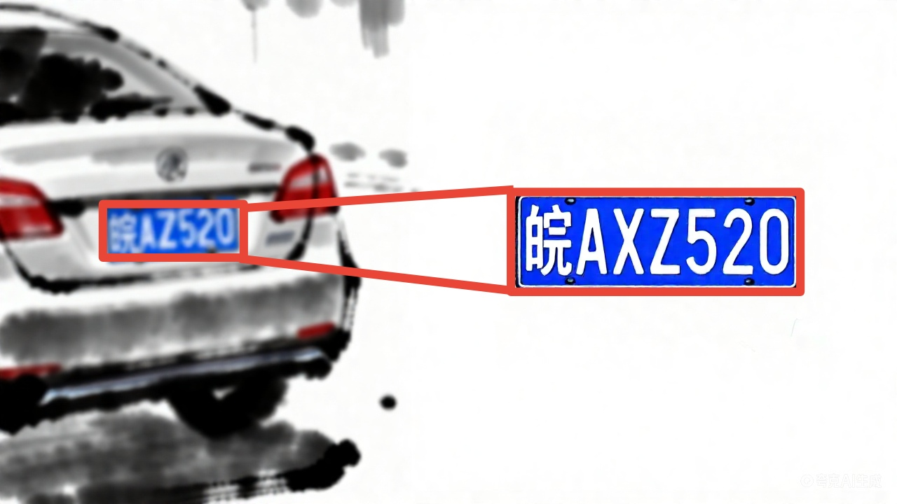
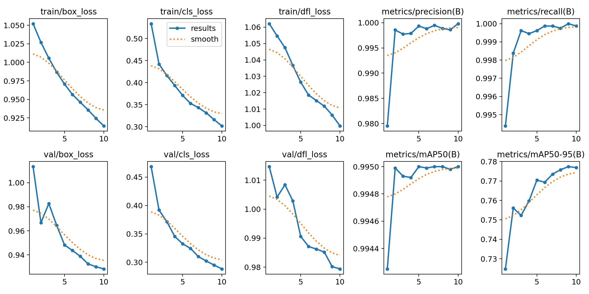
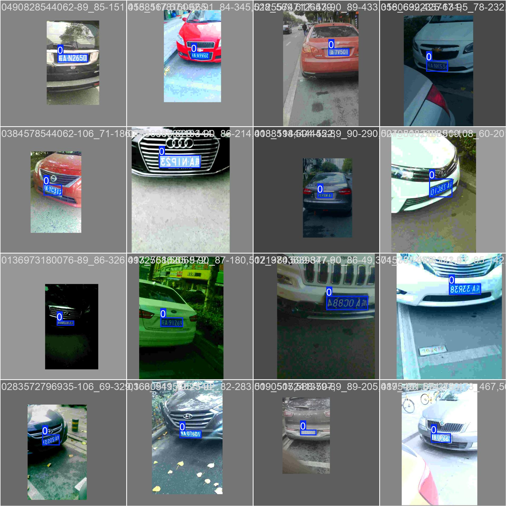
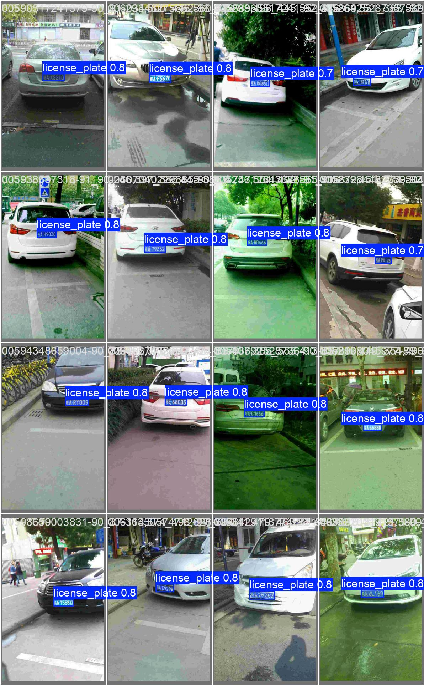
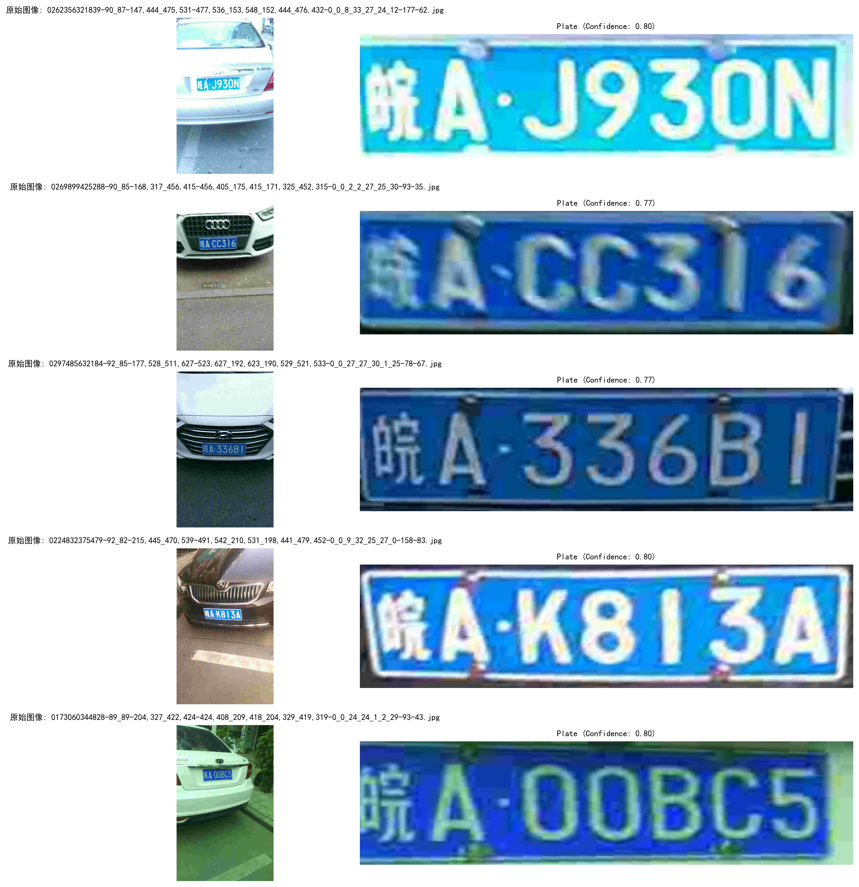
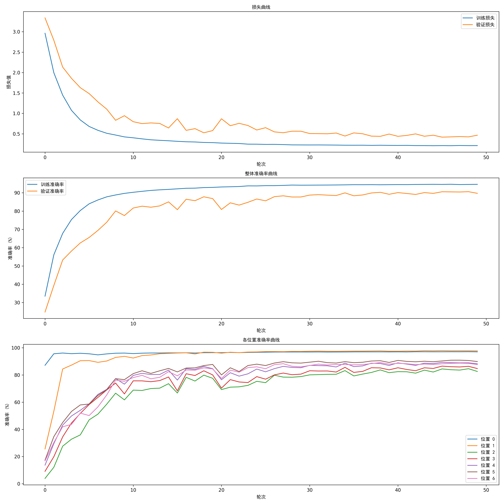
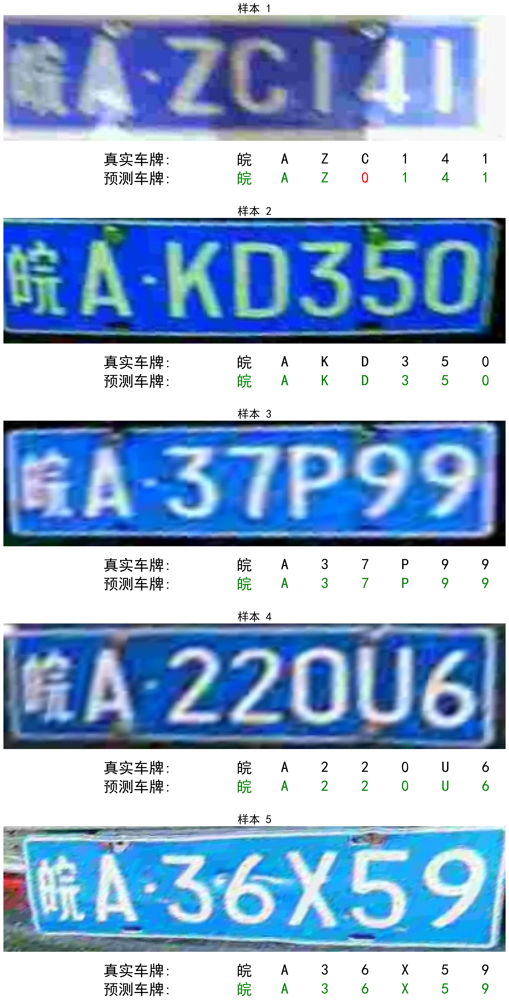
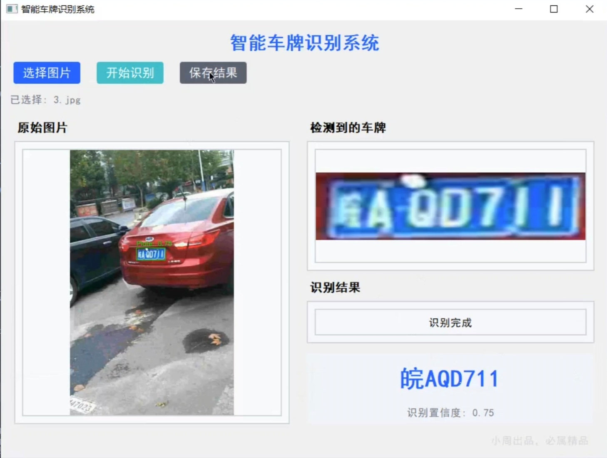

# **智能车牌识别系统（License Plate Recognition System）**



[](https://github.com/detectRecog/CCPD)[](https://docs.ultralytics.com/zh/models/yolov8/)[](https://pytorch.org/hub/pytorch_vision_mobilenet_v2/)[](https://www.mit.edu/)

---

## 📋目录

- 🌟[项目介绍](#项目介绍)
- 📊[数据集说明](#数据集说明)
- 📁[文件夹结构](#文件夹结构)
- 🧠[模型架构实现](#模型架构实现)
- 🚀[快速开始](#快速开始)
- 📈[结果展示](#结果展示)

---

## 一、项目介绍

本项目是一套 **端到端的中国车牌识别解决方案**，通过 “车牌位置检测 + 车牌内容识别” 两阶段流程，实现从原始车辆图片到车牌号码的自动化识别。系统具备高准确性、易用性和可扩展性，适用于停车场管理、交通违章监控、车辆出入登记等场景。

### 核心功能

1. **自动中文字体适配**：内置多平台中文字体自动加载与下载逻辑，解决中文显示乱码问题（支持 SimHei、WenQuanYi Micro Hei 等字体）

2. **车牌位置精准检测**：基于 YOLOv8 模型，实现复杂场景下的车牌定位，支持倾斜车牌矫正（通过顶点坐标透视变换 + 边界框旋转矫正）

3. **车牌内容识别**：采用 MobileNetV2+LSTM + 注意力机制的组合架构，针对中国 7 位车牌（省份简称 + 字母数字）优化，支持字符级准确率分析

4. **可视化 UI 界面**：基于 PyQt5 开发图形化界面，支持图片选择、一键识别、结果保存，直观展示原始图片、检测边界框、裁剪车牌及识别结果

5. **完善的训练机制**：

* 检测模型：支持早停机制（patience）、最佳模型自动保存、mAP 指标评估

* 识别模型：支持位置权重调整（针对低准确率字符位置加强训练）、数据增强（旋转、仿射、颜色抖动等）、训练历史可视化（损失曲线、准确率曲线）

### 技术栈

* 深度学习框架：PyTorch

* 检测模型：YOLOv8（Ultralytics）

* 识别模型：MobileNetV2 + LSTM + 注意力机制

* 可视化：Matplotlib、OpenCV

* UI 框架：PyQt5

* 数据处理：Pandas、NumPy、YAML


## 二、数据集说明

数据源于：[CCPD2019|车牌识别数据集|计算机视觉数据集](https://github.com/detectRecog/CCPD)

数据集或可由：[ccpd-preprocess](https://www.kaggle.com/datasets/binh234/ccpd-preprocess)

经我处理完毕的（使用ccpd原数据集中base下的20%部分，经过裁剪处理，可以直接训练识别）：[Plate_Recognition](https://www.kaggle.com/datasets/rexinshiminxiaozhou/plate-recognition)

### 1. 数据集结构

需按照以下目录结构组织数据集，核心包含**图片文件、标签文件、配置文件、车牌信息表**四部分：

```makefile
data/
├── plate_data.yaml       # 数据配置文件
├── plate_info.csv        # 车牌信息表（含图片名、车牌号、顶点坐标）
├── images/
    ├── train/            # 训练集图片（.jpg/.jpeg/.png）
    └── val/              # 验证集图片（.jpg/.jpeg/.png）
└── labels/               # YOLO格式标签文件（与图片同名，.txt格式）
   ├── train/
   └── val/
```

### 2. 关键文件说明

#### （1）plate\_data.yaml

用于配置数据集路径、类别信息，格式如下：

```makefile
train: ./images/train    # 训练集图片路径（相对/绝对路径均可）
val: ./images/val        # 验证集图片路径
nc: 1                    # 类别数量（仅车牌1类）
names: [license_plate]   # 类别名称（需与代码中class_name一致）
```

#### （2）plate\_info.csv

记录每张图片的车牌关键信息，字段说明：

| 字段名           | 类型  | 说明                                                         |
| ------------- | --- | ---------------------------------------------------------- |
| image\_name   | 字符串 | 图片文件名（需与 images 文件夹中文件完全一致，含后缀）                            |
| plate\_number | 字符串 | 真实车牌号码（中国车牌 7 位，如 “京 A12345”）                              |
| vertices      | 字符串 | 车牌四个顶点坐标（格式：\[\[x1,y1],\[x2,y2],\[x3,y3],\[x4,y4]]），用于倾斜矫正 |

#### （3）YOLO 标签文件（labels 目录下）

每个图片对应一个`.txt`标签文件，格式遵循 YOLO 标准：

```makefile
# 格式：[类别索引] [中心x/宽] [中心y/高] [宽/图宽] [高/图高]
0 0.523 0.345 0.120 0.085  
```

* 类别索引：固定为 0（仅车牌一类）

* 坐标：归一化坐标（取值 0-1）

### 3. 数据要求

* 图片分辨率：建议不低于 640×480（与模型输入尺寸 640 适配）

* 车牌角度：支持 ±30° 倾斜（内置矫正逻辑）


## 三、文件夹结构

```makefile
Car_Plate_Recognition/
├── README.md
├── demo.mp4                  # 演示视频文件
├── demo.py                   # 主程序文件，包含GUI界面
├── predict.py                # 车牌识别预测脚本
├── preprocess.py             # 数据预处理脚本
├── requirements.txt
├── train_location.py         # 车辆位置检测训练脚本
├── train_plate.py            # 车牌识别训练脚本
├── data/
	├── plate_data.yaml       # 数据配置文件
	├── plate_info.csv        # 车牌信息表（含图片名、车牌号、顶点坐标）
	├── images/
    	├── train/            # 训练集图片（.jpg/.jpeg/.png）
    	└── val/              # 验证集图片（.jpg/.jpeg/.png）
	└── labels/               # YOLO格式标签文件（与图片同名，.txt格式）
   		├── train/
   		└── val/
├── log/                      # 日志目录
├── output/
    ├── model/                # 模型文件目录
    ├── pic/                  # 图片输出目录
    ├── recognition-output/   # 识别输出目录
        └── training_history_mobilenet.json  # MobileNet训练历史数据
    └── yolo_train-output/    # YOLO训练输出目录
        ├── license_plate_detection/  # 车牌检测相关文件
        ├── runs/             # 训练运行记录
        └── test_samples_output/  # 测试样本输出
└── test/                     # 测试图片目录
```


## 四、模型架构实现

训练完毕的模型：[rexinshiminxiaozhou | Car_Plate_Recognition | Kaggle](https://www.kaggle.com/models/rexinshiminxiaozhou/car_plate_recognition)

系统分为**车牌检测模型**和**车牌识别模型**两个核心模块，流程如下：

```
原始车辆图片 → YOLOv8检测 → 车牌区域裁剪与矫正 → MobileNetV2+LSTM识别 → 输出车牌号码
```

### 1. 车牌检测模型（YOLOv8）

#### （1）模型基础

* 预训练权重：`yolov8m.pt`（中等规模模型，平衡速度与精度）

* 输入尺寸：640×640（可通过`img_size`参数调整）

* 输出：车牌边界框（x1,y1,x2,y2）、检测置信度

#### （2）训练逻辑

```makefile
# 核心训练参数（LicensePlateTrainer类）
epochs: 50          # 最大训练轮次
batch_size: 16      # 批次大小（根据GPU显存调整，CPU建议8）
patience: 5         # 早停机制：连续5轮mAP无提升则停止训练
classes: [0]        # 仅训练车牌类别（过滤其他类别干扰）
project: license_plate_detection  # 模型保存根目录
name: exp           # 实验名称（每次训练生成exp/exp1/exp2...）
```

#### （3）评估指标

* 核心指标：mAP@0.5（IoU=0.5 时的平均精度）、mAP@0.5:0.95（IoU 0.5-0.95 区间的平均精度）

* 辅助指标：精确率（Precision）、召回率（Recall）

### 2. 车牌内容识别模型（MobileNetV2+LSTM + 注意力）

#### （1）模型结构

1. **特征提取层（MobileNetV2）**：

* 基于预训练 MobileNetV2，移除原分类头，保留`features`特征提取部分

* 新增`1×1卷积层`将特征通道从 1280 降至 64，减少计算量

* 批归一化（BatchNorm2d）与 ReLU 激活函数提升稳定性

1. **序列处理层（LSTM）**：

* 输入维度：64×4（特征图高度 × 通道数，由特征图尺寸推导）

* 隐藏层大小：128，双向 LSTM（捕获前后文信息）

* dropout：0.6（防止过拟合，仅训练阶段生效）

1. **注意力机制层**：

* 结构：Linear (256→128) → Tanh → Linear (128→1)

* 功能：对 LSTM 输出的序列特征加权，强化关键字符位置的特征响应

1. **输出层**：

* Linear (256→num\_classes)（num\_classes=65，含 31 个省份简称 + 34 个字母数字）

* 固定输出 7 个字符位置（匹配中国车牌长度）

#### （2）训练优化

* **位置权重**：针对字符位置准确率差异，设置自定义权重（如`[1.0,1.0,2.2,2.0,1.8,1.8,1.8]`），对低准确率位置（第 3-7 位）加强损失惩罚

* **数据增强**：

```python
transforms.Compose([
   transforms.ToTensor(),
   transforms.Normalize(mean=[0.485,0.456,0.406], std=[0.229,0.224,0.225]),
   transforms.RandomRotation(degrees=15),              # 随机旋转
   transforms.RandomAffine(translate=(0.15,0.15)),     # 随机平移
   transforms.ColorJitter(brightness=0.3),             # 颜色抖动
   transforms.RandomPerspective(distortion_scale=0.15) # 透视变换
])
```

* **早停机制**：连续 8 轮验证准确率无提升则停止训练，保存最佳模型


## 五、快速开始

### 1. 环境准备

#### （1）安装依赖

```bash
pip install -r requirements.txt
```

#### （2）环境验证

```
\# 验证GPU是否可用（可选）

import torch

print("GPU可用:", torch.cuda.is\_available())

\# 验证YOLO安装

from ultralytics import YOLO

model = YOLO('yolov8m.pt')

print("YOLO模型加载成功")
```

### 2. 数据集配置

1. 按照`「二、数据集说明」`的结构组织数据集

2. 修改`plate_data.yaml`中的`train`/`val`路径为实际数据集路径

3. 确保`plate_info.csv`的`image_name`与图片文件名完全匹配（含后缀）

运行`preprocess.py`对初始的数据集（CCPD2019）进行划分（代码中采用 `ratio=0.2`），并处理为适合 YOLO 训练的格式

```bash
python preprocess.py
```

### 3. 模型训练

#### （1）训练车牌检测模型（YOLOv8）

运行 YOLO 检测代码，执行以下脚本：

```
python train_location.py
```

* 训练结果保存路径：`./license_plate_detection/exp/weights/`（含`best.pt`最佳模型、`last.pt`最后一轮模型）

#### （2）训练车牌识别模型（MobileNetV2）

运行 MobileNet 识别代码，执行以下脚本：

```
python train_plate.py
```

* 训练结果保存路径：`./``best_mobilenet_v2.pt`（最佳识别模型）、`./training_history_mobilenet_v2.png`（训练历史曲线）

### 4. 启动 UI 界面

运行 UI 代码，加载训练好的模型进行可视化识别：

```
python demo.py
```

#### UI 操作步骤

1. **模型加载**：程序启动后自动加载`./output/model/``best.pt`（检测模型）和`./output/model/``best_mobilenet.pt`（识别模型），需提前将训练好的模型放入对应路径

2. **选择图片**：点击「选择图片」按钮，选择含车牌的车辆图片（支持.jpg/.png 等格式）

3. **开始识别**：点击「开始识别」，系统自动检测车牌位置并识别号码

4. **查看结果**：界面左侧显示带检测框的原始图片，右侧显示裁剪后的车牌及识别结果（含置信度）

5. **保存结果**：点击「保存结果」，将识别结果（带框原图、裁剪车牌、txt 结果文件）保存至`./recognition_results`目录

### 5. 单张图片推理（命令行）

若无需 UI，可直接通过`predict.py`代码进行单张图片推理：

```
python predict.py
```


## 六、结果展示

### 1. 模型评估结果

#### （1）车牌检测模型（YOLOv8）

| 评估指标           | 数值示例  | 说明                 |
| -------------- | ----- | ------------------ |
| mAP@0.5        | 0.982 | IoU=0.5 时的平均精度     |
| mAP@0.5:0.95   | 0.925 | IoU 0.5-0.95 的平均精度 |
| 精确率（Precision） | 0.978 | 检测为车牌的样本中实际为车牌的比例  |
| 召回率（Recall）    | 0.965 | 实际为车牌的样本中被检测到的比例   |

#### （2）车牌识别模型（MobileNetV2）

| 评估指标       | 数值示例                                               | 说明                                                        |
| ---------- | -------------------------------------------------- | --------------------------------------------------------- |
| 整体字符准确率    | 0.923                                              | 所有字符位置的平均准确率                                              |
| 各位置字符准确率   | \[0.969, 0.968, 0.802, 0.835, 0.871, 0.870, 0.845] | 第 1-7 位字符的准确率（第 1-2 位为省份 + 字母，准确率较高；第 3-7 位为字母数字，准确率相对较低） |
| 单车牌完整识别准确率 | 0.856                                              | 7 位字符完全识别正确的车牌比例                                          |

### 2. 可视化结果

#### （1）车牌位置检测

训练历史曲线：

* **损失曲线**：训练损失与验证损失随轮次下降，最终趋于平稳（无明显过拟合）

* **准确率曲线**：训练准确率与验证准确率同步上升，最佳验证准确率稳定在 92% 以上




训练过程中得到的训练检测：



验证检测：



初步使用YOLOv8定位并进行矫正裁剪的车牌测试结果如下：



#### （2）车牌内容检测

训练历史输出如下：



在验证集上识别的输出如下：



#### （3）UI 界面展示

| 界面区域   | 展示内容                                                     |
| ---------- | ------------------------------------------------------------ |
| 原始图片区 | 左侧显示输入的车辆图片，叠加绿色边界框标记车牌位置，标注检测置信度（如 “Plate: 0.78”） |
| 车牌显示区 | 右侧上方显示裁剪并矫正后的车牌图片（尺寸统一为 400×100）     |
| 结果显示区 | 右侧下方显示识别出的车牌号码（如 “皖A QD711”）及识别置信度（如 “识别置信度: 0.75”） |



#### （3）保存的结果文件

每次识别后保存至`./recognition_results`目录，包含：

* `xxx_marked.jpg`：带车牌边界框的原始图片

* `xxx_plate.jpg`：裁剪并矫正后的车牌图片

* `xxx_result.txt`：识别结果文本，格式如下：

```makefile
进入事件循环...
使用设备: CPU
加载车牌检测模型: ./output/model/best.pt
加载车牌识别模型: ./output/model/best_mobilenet.pt
识别结果: 皖AQD711 (检测置信度: 0.75)
```

